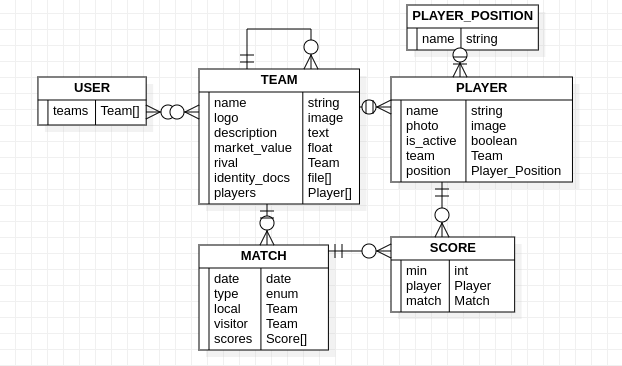

# Seed star-uml

The seed staruml extension is a plugin to facilitate the creation of SeedManifest.json file, which defines the structure of models, relationships and attributes to allow [**Seed Builder**](https://github.com/erick-rivas/seed-npm) to work.

## Installation:

-   Clone this repository in the folder:

    -   MacOS: ~/Library/Application Support/StarUML/extensions/user
    -   Windows: C:\\Users\\\AppData\\Roaming\\StarUML\\extensions\\user
    -   Linux: ~/.config/StarUML/extensions/user 

## Extension usage

-  Create a new **ER-Diagram**
-  Create entities and relationship according to the data modeling

### Guidelines

1.  Each entity must follow the following format **MODEL_NAME**
2.  Each attribute must follow the following format **attribute_name: primitive_type** or **atribute_type: Custom_Type**
     >  Example: name: string / player: Player
3.  It is not necessary to include primary keys (e.g. id or pk), these are generated automatically

4.   Besides graphic relationships, each child entity must include an attribute to reference their parent
     >   Example: if a Team entity has many Players, Player entity must have a *team: Team* attribute

5.   For Many to N relationships it can be include a Child_Type[] attribute to reference their child entities
     >   Example: if a Team entity has many Players, Team entity can have a *players: Players[]* attribute

6.   To enable authentication requirements, the diagram **must include a USER entity**, this entity already includes common fields (email, password, name & last_name), so you only have to add additional fields. Example: profile_image.

Diagram example \
  

## Attributes types

-   int: Integer type
-   string: String type (varchar)
    >   This data type needs *length* attribute in [metadata](#metadata)

-   date: Datetime type
-   boolean: Bool type
-   float: Float / Double type
-   json: Json type
-   enum: Enum type (string with pre-defined values)
    >   This data type needs *options* attribute in [metadata](#metadata)

-   text: Text type (long string)
-   image / image[]: Image type 
-   file / file[]: File type (url)

## Metadata

The metadata refers to extra information included in attributes & models to specify properties (e.g. string length, nullable types, etc).

It is specified inside **Documentation** textarea of startuml and must follow the structure (*attribute: value*) separated by newlines

Example \

### Attributes metadata

-   default: Define the default value of an attribute
    -   Default (date): now
    -   Default (bool): false

-   empty: Define whether an attribute is null/blank or not
    -   Default: false
    >   It also can be defined in the nullable checkbox of Properties

-   read: Define whether an attribute is readable
    -   Default: true

-   write: Define whether an attribute can be written / changed or deleted
    -   Default: true
    >   0..* to 1 attributes are defined as false as the default

-   length: Define the maximum length of a field
    >   Required for all string attributes \
    >   It also can be defined in the length text of Properties

-   options: Define the available options of an enum
    >   Required for all enum attributes

-   description: Define the description of an attribute to show in documentation

### Entities metadata

-   delete: Define the behavior of a fk attribute on delete
    -   Options:
        -   CASCADE: Delete the objects that have references to it 
        -   PROTECT: To delete it you will have to delete all objects that reference it
        -   EMPTY: Set objects that have reference to NULL (requires 'empty' of references)
    -   Default: CASCADE

-   db_table: Define the database table name of a entity
-   managed: Define if a entity is managed by framework
-   description: Define the description of an entity to show in documentation

### Relationships metadata 

-   ref: Override parent cardinality (N has any)
    -   Usage: Use it when there are two fk with different cardinality
    -   Values: 1 | 0..* 
    -   Default: Graphic cardinality

-   to: Override child cardinality (any has N)
    -   Usage: Use it when there are two fk with different cardinality
    -   Values: 1 | 0..*
    -   Default: Graphic cardinality

## Common errors

-   When delete a relation, press right click and select **delete from model** otherwise it is preserved and could generate duplicates
-   Deeply analyzes one-to-one relationships because they are usually used for very particular cases

## References

-   Seed-npm repository: [https://github.com/erick-rivas/seed-npm](https://github.com/erick-rivas/seed-npm)
-   StarUML reference: [https://staruml.io/extensions](https://staruml.io/extensions)
-   StartUML model example [example.mdj](example.mdj)