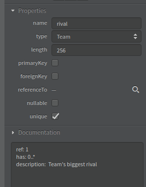

# Seed star-uml

This repository holds the source code of the **star-uml extension** for the **seed-builder** project written mainly in javascript.

## Table of content

-   [Overview](#overview)
-   [Pre-requisites](#pre-requisites)
-   [Installation](#installation)
-   [Extension usage](#extension-usage)
    -   [Attributes types](#attributes-types)
    -   [Relations & fks](#relations-&-fks)
    -   [Metadata](#metadata)
    -   [Override metadata](#override-metadata)
-   [Common errors](#common-errors)
-   [References](#references)

## Overview

The seed staruml extension is a plugin that ease the creation of SeedManifest.json files, which defines the structure of models, relationships and attributes in order to enable the operation of the [**Seed Builder**](https://github.com/erick-rivas/seed-npm)

## Pre-requisites:

-   Download & install [Node js](https://nodejs.org/en/download/) or an equivalent.
-   Download & install [Visual Studio code](https://code.visualstudio.com/) or an equivalent (optional).

## Installation:

-   Clone this repository in the folder:

   -   MacOS: ~/Library/Application Support/StarUML/extensions/user
   -   Windows: C:\\Users\\\AppData\\Roaming\\StarUML\\extensions\\user
   -   Linux: ~/.config/StarUML/extensions/user 

-   Open staruml and run "Generate SeedManifest" option in tools menu

## Extension usage

-  To start using the extension create a new **ER-Diagram**

-  Each model (table) must follow the following format *MODEL_NAME*

-  It is not necessary to include primary keys because these are generated **automatically**

-  Each attribute must follow the following format *attribute_name: type*

  
>   Example diagram


### Attributes types

Each attribute can have the following types

-   int: Integer type
-   string: String type (varchar)
    >   This data type needs *length* attribute in [metadata](#metadata)

-   date: Datetime type
-   boolean: Bool type
-   float: Float/Double type
-   json: Json type
-   enum: Enum type (string with defined values)
    >   This data type needs *options* attribute in [metadata](#metadata)

-   text: Text type (long string)
-   image / image[]: Image type 
-   file / file[]: File type (url)

### Relations & fks

-   Each one to any relation must include an attribute to reference the parent model
    >   Example: if a Car model has many Wheels, Wheels model must have a *car: Car* attribute  

-   Many to any attributes (ex. players: player[]) are defined to write=false by default

### Metadata

Each attribute & model can have additional information inside the **Properties** pane in staruml

It must be place in the **Documentation** textarea and must follow the following structure *attribute: value* separated by newlines

Example
```
default: red
description: Attribute to store theme_color  
```

#### Metadata types

This are the attributes enabled by the extension

-   default: Define the default value of an attribute
   -   Default(date): now
   -   Default(bool): false

-   empty: Define whether an attribute is null/blank or not
    -   Default: false
    >   It also can be defined in the nullable checkbox of Properties


-   read: Define whether an attribute or model can be read
   -   Default: true

-   write: Define whether an attribute or model can be written / changed or deleted
    -   Default: true
    >   0..* to 1 attributes are defined as false as the default

-   delete: Define the behavior of a fk attribute on delete
    -   Options:
        -   CASCADE: Delete the objects that have references to it 
        -   PROTECT: To delete it you will have to delete all objects that reference it
        -   EMPTY: Set objects that have reference to NULL (requires 'empty' of references)
    -   Default: CASCADE

-   length: Define the maximum length of a field
    >   Required for all string attributes \
    >   It also can be defined in the length text of Properties

-   options: Define the available options of an enum
    >   Required for all enum attributes

-   description: Define the description of the model or attribute to show in documentation


### Override metadata

-   ref: Override parent cardinality (N has any)
    -   Usage: Use it when there are two fk with different cardinality
    -   Values: 1 | 0..* 
    -   Default: Graphic cardinality


-   to: Override child cardinality (any has N)
    -   Usage: Use it when there are two fk with different cardinality
    -   Values: 1 | 0..*
    -   Default: Graphic cardinality

  
>    Example metadata

### Extras

-   To enable authentication requirements, the diagram needs a **USER**, this model already includes common fields (email, password, name & last_name), so you only have to add additional fields. Example: profile_image.

    >   In case you do not need add attributes, leave the model empty.

## Common errors

-   When delete a relation, press right click and select **delete from model** otherwise it is preserved and could generate duplicates

-   Deeply analyzes one-to-one relationships because they are usually used for very particular cases


## References

-   Seed-npm repository: [https://github.com/erick-rivas/seed-npm](https://github.com/erick-rivas/seed-npm)
-   StarUML reference: [https://staruml.io/extensions](https://staruml.io/extensions)
-   StartUML model example [example.mdj](example.mdj)